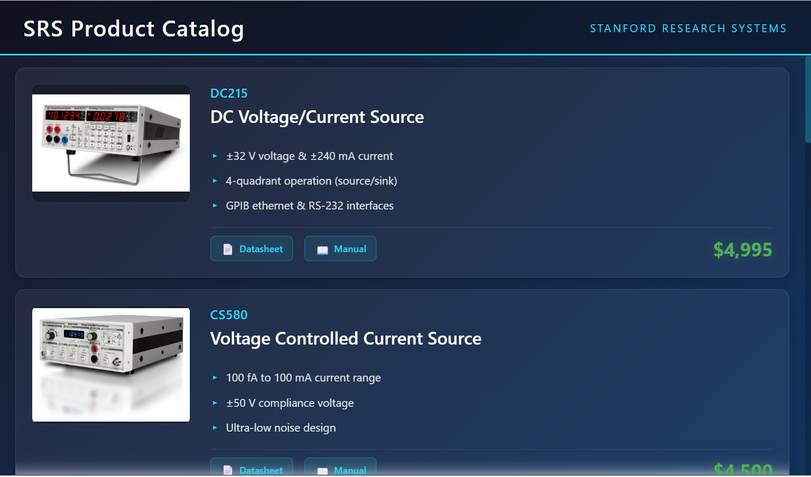

# SRS Product Display System

A fully-templated HTML display system for showcasing SRS (Stanford Research Systems) products on a 1024 x 600 px 7" tablet.



Products are listed in a CSV file and HTML file is automatically-generated from the CSV and an HTML template
  (which defines the aesthetic style of the page).

## Files Included

1. **template.html** - Jinja2 HTML template with product display layout
2. **products.csv** - Product data in CSV format
3. **generate.py** - Python script to render the template with CSV data
4. **product_display.html** - Generated HTML output (ready to use)

## Product Data Structure

The CSV file contains the following columns:

The CSV file contains the following columns:

- `product_pn` - Product part number (e.g., SR542)
- `category` - Product category for grouping and navigation
- `product_name` - Full product name (e.g., Precision Optical Chopper)
- `bullet_1` - First feature/specification
- `bullet_2` - Second feature/specification
- `bullet_3` - Third feature/specification
- `datasheet_link` - URL to product datasheet PDF
- `manual_link` - URL to product manual PDF
- `product_page_url` - URL to product page (card click destination)
- `price` - Product price (formatted as $X,XXX)
- `thumbnail` - Filename of product image (placed in images/ folder)

## Products Included

All 9 requested SRS products:

1. **DC215** - DC Voltage/Current Source
2. **CS580** - Voltage Controlled Current Source
3. **DC205** - Precision DC Voltage Source
4. **SR865A** - 4 MHz Lock-in Amplifier
5. **SR2124A** - Dual Phase Analog Lock-in Amplifier
6. **SR542** - Precision Optical Chopper
7. **LDC501** - Laser Diode Controller
8. **SR446** - 400 MHz Preamplifier
9. **SR560** - Low Noise Voltage Preamplifier

## Usage

### Option 1: Use Pre-Generated HTML
Simply open `product_display.html` in a browser on your 7" tablet.

### Option 2: Regenerate from Template

1. Edit `products.csv` to modify product data
2. Run the generation script:
   ```bash
   python3 generate.py
   ```
3. Open the newly generated `product_display.html`

## Category Navigation

The display includes two ways to navigate between product categories:

### 1. Hamburger Menu (Left Side)
Click the hamburger icon (☰) in the top-left to open a sliding category menu:
- Slides in from the left with a dark overlay
- Shows all categories as clickable items
- Click any category to jump to it (menu auto-closes)
- Click X or the overlay to close without selecting

### 2. Search Box (Center)
Real-time search with autocomplete suggestions:

**Search Features:**
- Searches across product part numbers, names, and categories
- Case-insensitive matching
- Shows results instantly as you type
- Displays up to 10 matching products
- Auto-closes when clicking outside the search area

**Search Examples:**
- Type `dc` → Shows DC205, DC215
- Type `lock-in` → Shows SR2124, SR865A
- Type `preamp` → Shows all preamplifiers
- Type `sim` → Shows all SIM modules

**To add/modify categories:**
1. Edit the `category` column in `products.csv`
2. Run `generate.py` to rebuild the HTML
3. Categories and search index update automatically

## How Search Works

The search functionality is implemented entirely in client-side JavaScript with no server required.

### Search Algorithm

When a user types in the search box, the `handleSearch()` function:

1. **Normalizes the query**: Converts to lowercase and trims whitespace
2. **Filters products**: Searches through the product array for matches in:
   - `product_pn` (part number) - e.g., "SR542", "DC215"
   - `product_name` (full name) - e.g., "Precision Optical Chopper"
   - `category` (category name) - e.g., "Lock-in Amplifiers", "Preamplifiers"
3. **Returns matches**: Uses JavaScript `.includes()` for substring matching
4. **Limits results**: Shows maximum of 10 results to keep dropdown manageable
5. **Renders dropdown**: Dynamically creates HTML for each matching product

### Data Structure

The product search data is embedded in the HTML as a JavaScript array:

```javascript
const products = [
    {
        pn: "SR542",
        name: "Precision Optical Chopper",
        category: "Laser/Optical",
        url: "https://www.thinksrs.com/products/sr542.html"
    },
    // ... more products
];
```

This data is automatically generated from the CSV when running `generate.py`.

### Search Result Display

Each search result shows:
- **Part Number** (top line, cyan color) - The product PN like "SR542"
- **Product Name** (bottom line, white) - Full name like "Precision Optical Chopper"

When a result is clicked:
- Opens the product page in a new tab
- Clears the search box
- Closes the search results dropdown

### Customizing Search Behavior

To modify search behavior, edit the `handleSearch()` function in `template.html`:

**Change minimum characters before search:**
```javascript
if (!query || query.trim().length < 1) {  // Change '1' to your desired minimum
```

**Change maximum results shown:**
```javascript
matches.slice(0, 10).forEach(product => {  // Change '10' to show more/fewer results
```

**Modify search fields:**
```javascript
const matches = products.filter(product => 
    product.pn.toLowerCase().includes(searchTerm) ||
    product.name.toLowerCase().includes(searchTerm) ||
    product.category.toLowerCase().includes(searchTerm)
    // Add more fields here if needed
);
```

**Add fuzzy matching or weighting:**
The current implementation uses simple substring matching. For more advanced search (fuzzy matching, relevance scoring), you could integrate libraries like:
- Fuse.js (fuzzy search)
- Lunr.js (full-text search)
- Mark.js (highlight matching terms)

### Performance Notes

- Search is performed on every keystroke (`oninput` event)
- With 29 products, performance is instant
- For catalogs with 1000+ products, consider:
  - Debouncing the search (wait 200ms after typing stops)
  - Using a search library with indexing
  - Implementing result pagination

## Adding Product Images

1. Create an `images/` folder in the same directory as the HTML file
2. Place product thumbnail images in this folder
3. Update the `thumbnail` column in `products.csv` with the image filename

## Display Specifications

- **Screen Resolution**: 1024 x 600 pixels
- **Layout**: Scrollable card-based design
- **Design**: Modern dark theme with cyan accents
- **Features**:
  - **Hamburger Menu Navigation** - Slide-out category menu from left side
  - **Live Search** - Real-time autocomplete search across products
  - **Automatic Sorting** - Products grouped by category
  - **Category Headers** - Visual separators between product groups
  - Clickable product cards (click anywhere to visit product page)
  - Product images (280x200px display area)
  - Product part number and name
  - Three bullet-point features
  - Direct links to datasheets and manuals
  - Pricing information (top right of each card)
  - Smooth hover effects and scrolling
  - Custom scrollbar

## Customization

### Modify the Template
Edit `template.html` to change:
- Colors and styling (CSS section)
- Layout structure
- Card design
- Header/footer

### Update Product Data
Edit `products.csv` to:
- Add new products (add rows)
- Modify existing products (edit cells)
- Remove products (delete rows)

### Change Display Size
To adapt for different screen sizes, modify the CSS in `template.html`:
```css
body {
    width: 1024px;  /* Change width */
    height: 600px;  /* Change height */
}
```

## Technical Notes

- Uses Jinja2 templating for dynamic content
- No external dependencies required for viewing HTML
- Links point to actual SRS documentation URLs
- Product data scraped from thinksrs.com (February 2026)
- Prices are approximate U.S. list prices

## Browser Compatibility

Works with all modern browsers:
- Chrome/Edge
- Firefox
- Safari

Optimized for tablet display with touch-friendly spacing and hover effects.
